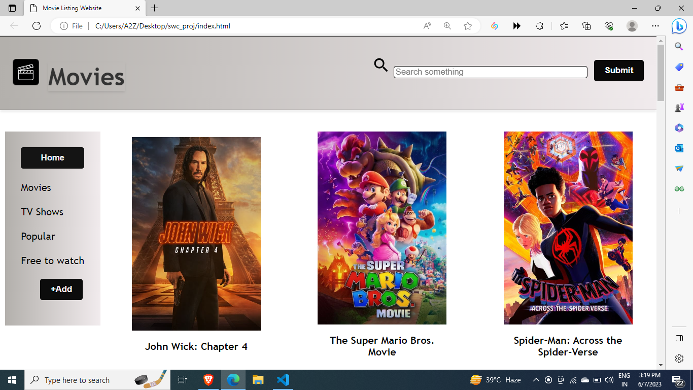
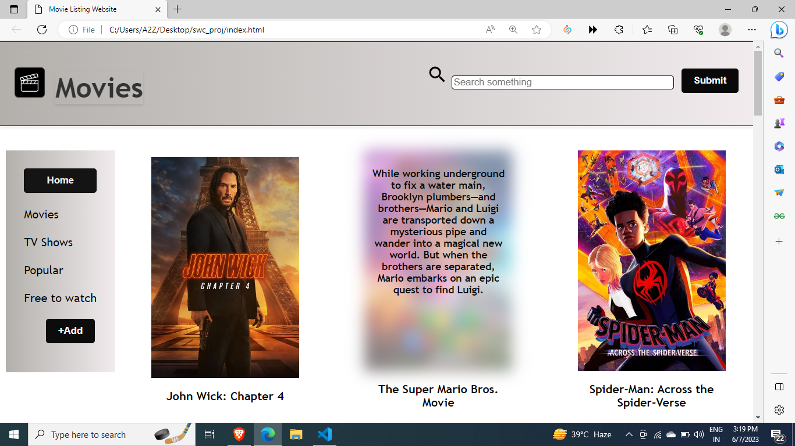
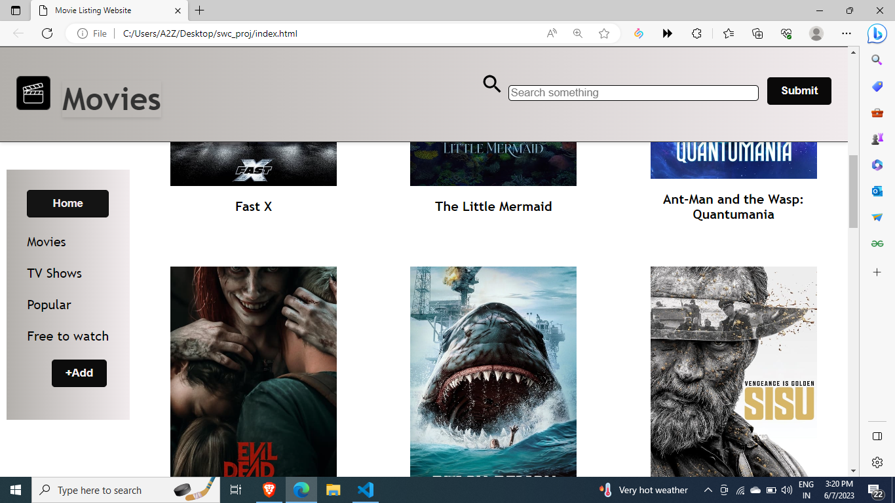
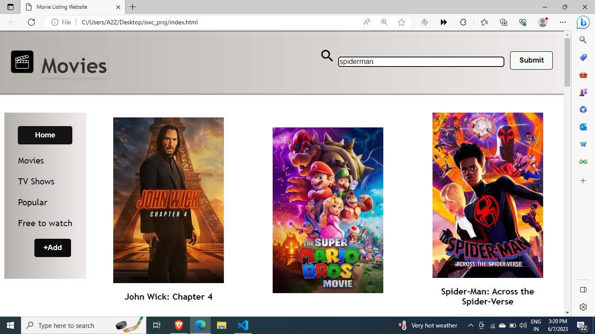
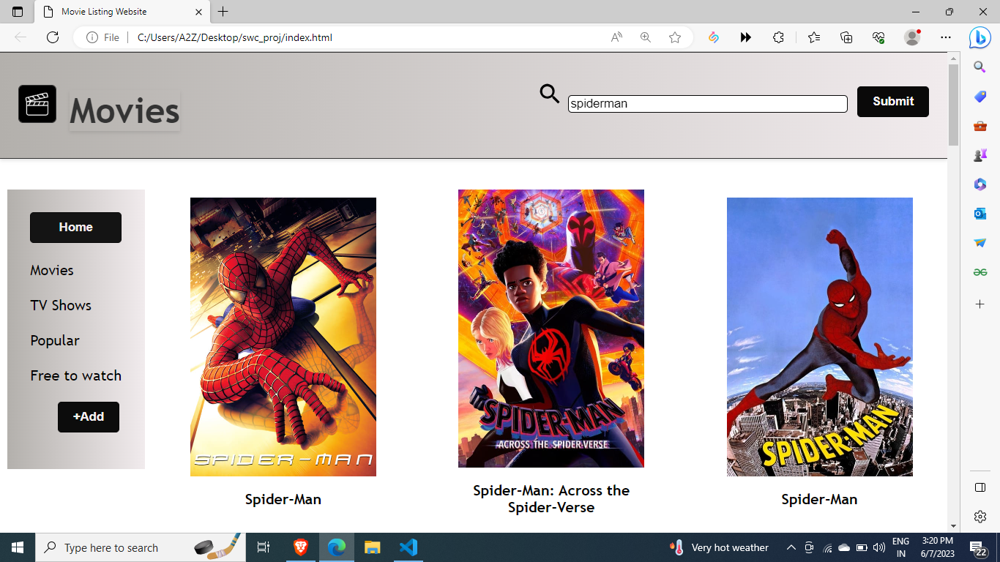

# MOVIE LISTING WEBSITE
# Submission for Student's Web Committee Workshop (IIT Guwahati)

This is a simple website that fetches data from another website using asynchronous javascript and display that data inside our website.
It also allows users to search for movies using The Movie Database (TMDb) API and display the results in a visually appealing manner.

## Features

- Fetches movie data from the TMDb API based on popularity or search query.
- Displays movie information in responsive boxes with images and titles.
- Shows movie overview when hovering over a movie box.
- The movie search feature provides users with the ability to find movies based on specific criteria or keywords.

## Interface

1. Layout of the Website:
   
       

2. When the cursor is placed over the box in the website, the layout undergoes a transformation to enhance interactivity and improve visual aesthetics. The following changes occur:
   a. Poster Opacity: The opacity of the movie poster decreases slightly, creating a subtle visual effect.
   b. Overview Display: A brief overview of the movie is revealed. It initially remains hidden but becomes visible when the cursor is positioned over the box.

       

3. Layout on scroll:
   The header and the sidebar remains fixed while the site is scrolled.

       

4. Searching:
   
       Movies can be searched by typing the name in the search bar and clicking on the submit button.

       
       
       Search results appear as shown

       

## Technologies Used

- HTML
- CSS
- JavaScript

## Setup and Usage

1. Clone the repository or download the source code.

       git clone https://github.com/your-username/movie-search-app.git

2. Open the `index.html` file in a web browser.

3. Use the search input field to search for movies by title.

4. Click the search button to fetch and display the movie results.

## Configuration

The following constants are defined in the JavaScript code and can be modified as needed:

- `API_KEY`: The API key used for authenticating requests to the TMDb API.
- `BASE_URL`: The base URL for the TMDb API.
- `API_URL`: The URL for fetching popular movies.
- `IMG_URL`: The URL for retrieving movie poster images.
- `searchURL`: The URL for searching movies by title.

## Customization

The CSS code provided can be modified to customize the appearance of the web app. The styles of the header, sidebar, movie boxes, and other elements can be changed to match the desired design.

## Credits

- The Movie Database (TMDb): [https://www.themoviedb.org/](https://www.themoviedb.org/)

